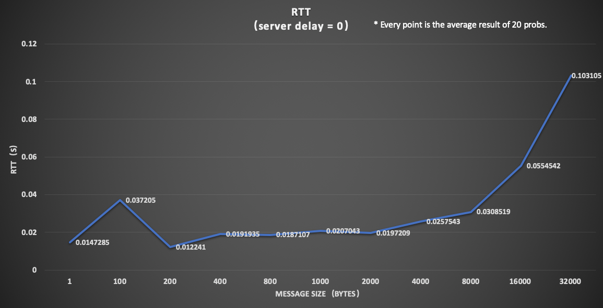
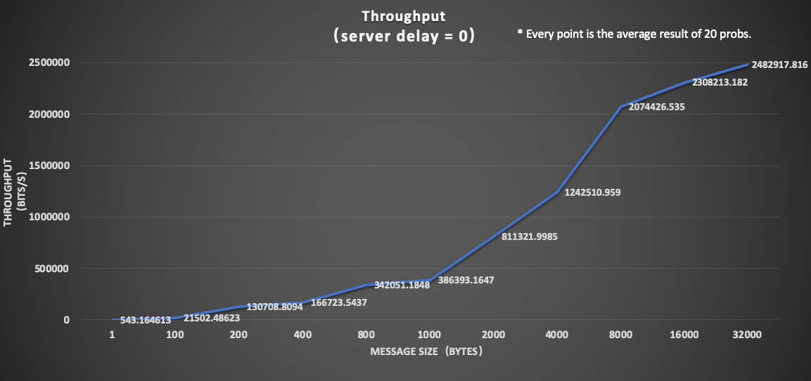
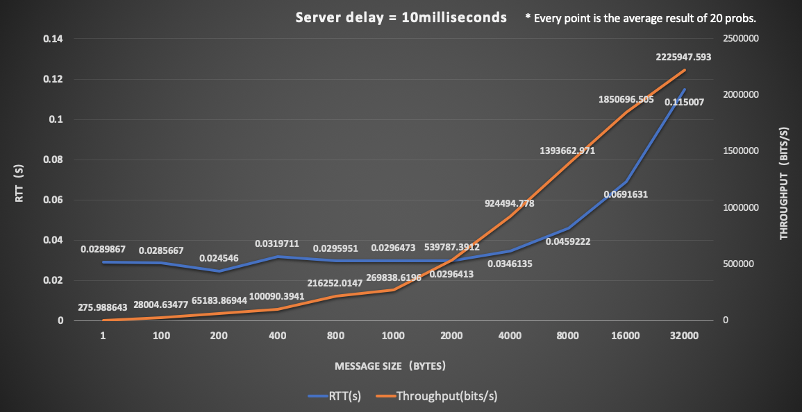
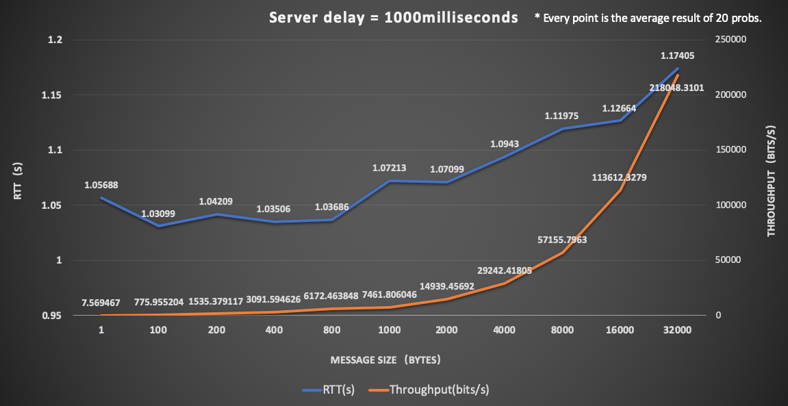

# An Multi-threading Cient-Server Echo Application Performing RTT and Throughput Measurements
This is a extension version of echo application which perform RTT and Throughput measurement based on TCP connection and custom protocal build upon TCP connection. The custom protocal consists of three phase, which are:

1. Connection Setup Phase(CSP)

    `<PROTOCOL PHASE><WS><MEASUREMENT TYPE><WS><NUMBER OF PROBES><WS><MESSAGE SIZE><WS><SERVER DELAY>\n`

    In this phase, a client will parse the parameters needed to be in the CSP protocal from command line input of user, then constructing the protocal string and sending to a connected server. The client will then wait for server's reponse. A server received this protocal messages will parse it and check the validity of each argument in the message. If all of the arguments are valid, the server will store a descripor for further uses on checking. It will also send a valid signal back to client which enable client to proceed into next phase. If not all of the arguments are valid, server will terminate the connection and send a invalid signal to client. The client will terminate the connection itself once receiving the invalid signal from server.  
    
2. Measurement Phase(MP)
    
    `<PROTOCOL PHASE><WS><PROBE SEQUENCE NUMBER><WS><PAYLOAD>\n`

    In this phase, a client proceeds to send probing messages to server. It will construct a payload with size specified before and prepare a starting timestamp just before sending messages. Once the server received a probing message from client, it checks the sequence and size of every probing message and echo the message back together with valid signal("200 OK\n") if the message is valid. The client proceeds to send more probing message and interact server in this way with qulified signals till the number of probing messages sent reach the number of probes specified in previous phase. After receiving all echos, the client timestamp a end stamp and obtain the total RTTs as well as average RTT for each probe. The client then proceed to Connection Termination Phase.

3. Connection Termination Phase(CTP)
    
    `<PROTOCOL PHASE>\n`

    To disconnect, a client simply send this termination message to its server. The server will close the connection first and reply a termination OK signal to client. Once receiving any replys from server, the client safely terminate the socket connection itself, and at last printing the average RTT & Throughput results to user.

In this application, the server maintains multiple threads for different clients connected. Each thread interacts with its client in a sequential manner of these three phases. Both of the server and client side detect message errors and catch socket errors. Once encountering an error, the socket connection will terminate and the corresponding thread in server side will be recliamed.

## Compilation instructions

To compile successfully, you need to have at the version of C++11.

**Client**: use `g++ client.cpp -std=c++1y -o client.out` to compile

**Server**: use `g++ server.cpp -std=c++1y  -lpthread -o server.out` to compile

(You dont necessarily need to compile them again because there are excutable files already provided.)

## Running instructions

1. Always use `./server.out [port](58000)` to run server first! Otherwise the client will never get connected. You can specify any port number from [58000, 58999]. If you don't specify any port number, it will use 58000 in default.
2. After starting your server, use `./client.out [host]("localhost") [port](58000)` to start clients as many as you want. It will use "localhost" in default if you do not specify any host for your starting server. If you want to specify a port number, you must specify the hostname first. The program will use port 58000 in default. You can see the connecting process at both sides.
3. Once the client started, you need to specify every configuration for the probing message, which will be formatted as CSP protocal. The configurations you need to enter from command line includes e.g. `TYPE(rtt or tput) | #PROBS(10) | MESSAGE_SIZE(100) | SERVER_DELAY(0)`. You need to input each configuration in sequence and with whitespace between each of them.
4. Once the client received valid configuration, it starts issuing setup messges and probing messages phase by phase. You can see all of signaling messages and echos at both sides.
5. Finally the client will print the average RTT and the average Throughput which are both calculated during the MP phase based on your configuration as well.

## Performance results & analysis
### Test setup
* Client: home laptop, server: cas2.bu.edu
* Number of probs: 20, message_size: [1, 320000] Bytes
* Three tests with different server delay
    1. Server delay = 0
    2. Server delay = 10 millionseconds
    3. Server delay = 1000 millionseconds
    
### Data & graphs
### TEST1

|Message Size(Byte) |  RTT(s) | Throughput(bits/s) |
|------------------ | --------| -------------------|
|1 |  0.0147285|543.164613 |
|100| 0.037205|21502.48623|
|200 |0.012241|130708.8094|
|400 |0.0191935|166723.5437|
|800 |0.0187107|342051.1848|
|1000|0.0207043|386393.1647|
|2000|0.0197209|811321.9985|
|4000|0.0257543|1242510.959|
|8000|0.0308519|2074426.535|
|16000|0.0554542|2308213.182|
|32000|0.103105|2482917.816|

**TEST1:: RTT**

**TEST1:: Throughput**

### TEST2

|Message Size(Byte) |  RTT(s) | Throughput(bits/s) |
|------------------ | --------| -------------------|
|1  | 0.0289867|   275.988643|
|100| 0.0285667|   28004.63477|
|200| 0.024546 |   65183.86944|
|400| 0.0319711|   100090.3941|
|800| 0.0295951|   216252.0147|
|1000|    0.0296473|   269838.6196|
|2000|    0.0296413|   539787.3912|
|4000|    0.0346135|   924494.778|
|8000|    0.0459222|   1393662.971|
|16000|   0.0691631|   1850696.505|
|32000|   0.115007|    2225947.593|

### TEST3

|Message Size(Byte) |  RTT(s) | Throughput(bits/s) |
|------------------ | --------| -------------------|
|1   |1.05688| 7.569467|
|100 |1.03099| 775.955204|
|200 |1.04209| 1535.379117|
|400 |1.03506| 3091.594626|
|800 |1.03686| 6172.463848|
|1000|   1.07213| 7461.806046|
|2000|   1.07099| 14939.45692|
|4000|    1.0943|  29242.41805|
|8000|    1.11975| 57155.7963|
|16000|   1.12664| 113612.3279|
|32000|   1.17405| 218048.3101|

### Analysis

For server delay = 0, the average RTT keeps being stable before the message size reach 8K Bytes. Before the message size reaches 8K Bytes, we can think that the propagation delay between client and server, which is a function of speed and distance, domintes the performance result of RTT. However, when the data size grows beyond a threshold, the RTT starts to grow linearly or even exponentially. This is because when the message size increases, the time used for transimission gradually overtakes the fixed propagation time and then dominates the RTT when having messages of relative large size.  As to throughput, it is a function of message size / RTT. The graph measured for throughput shows a similar trend with RTT. In our measurements, we actually measured 2 x transmission delays and 1 x round-trip propagation delay.

For server delay = 10ms or 1000ms, we model a longer propagation delay for messages we sent. In this case, the way how RTT and Throughput scales is similar to no delay. We can see from both of the results that the base magnitude of RTTs are largely depends on the server delay time we set. The longer propagation delay we model, the less throughput that it shows to send messages of same size.